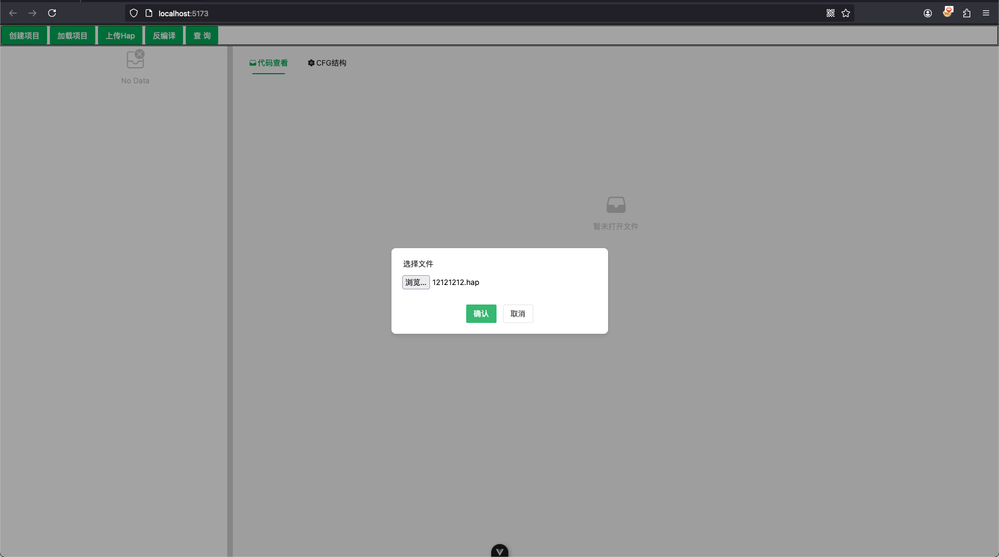
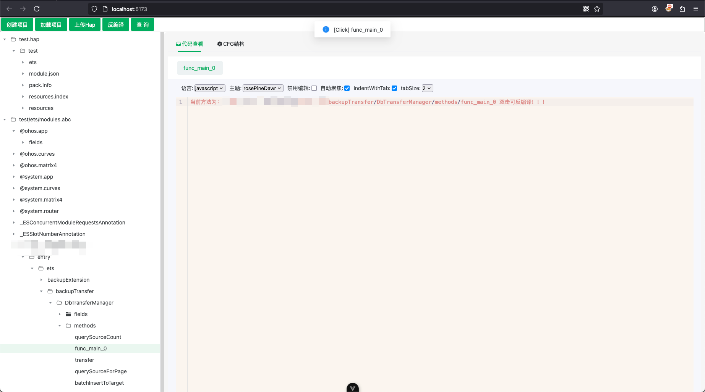
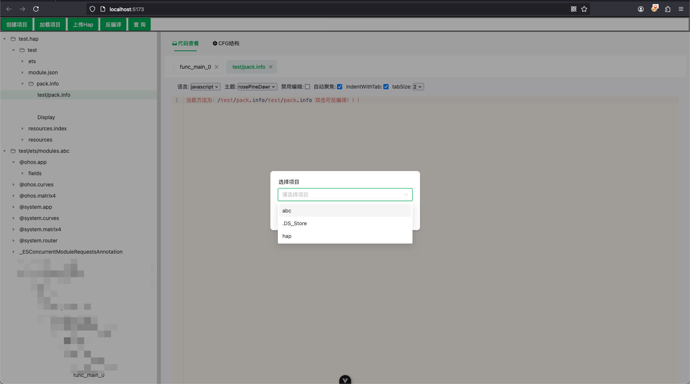
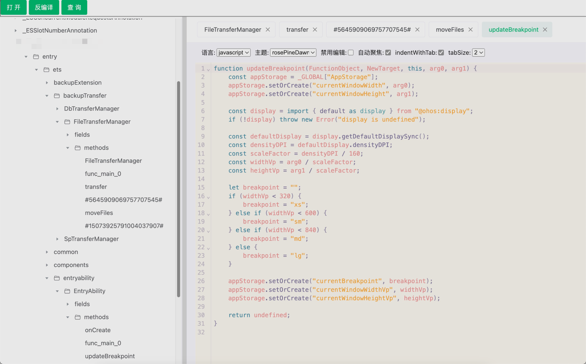
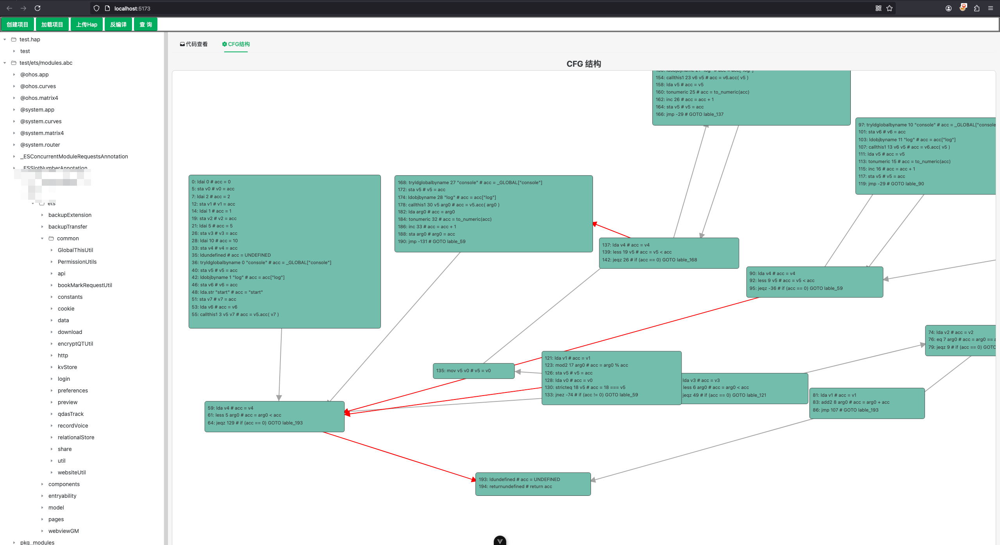
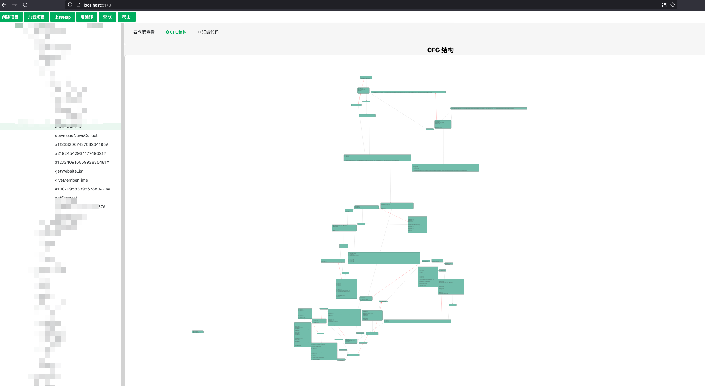
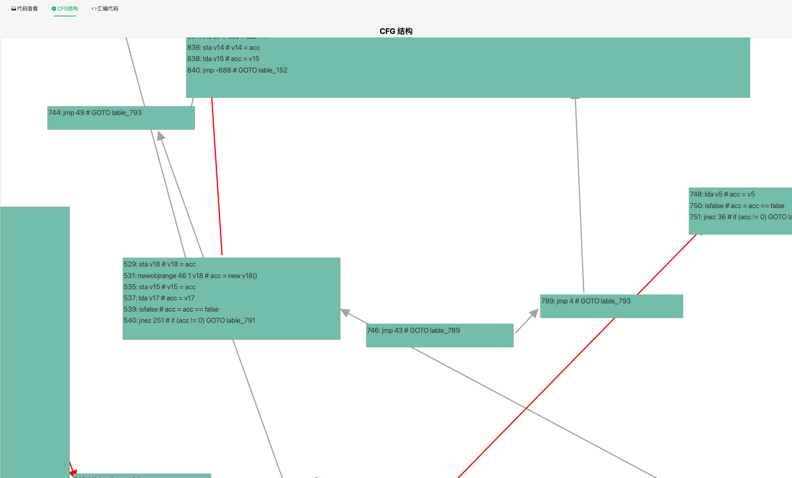
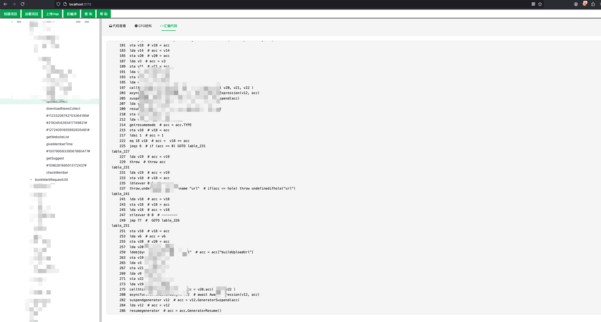
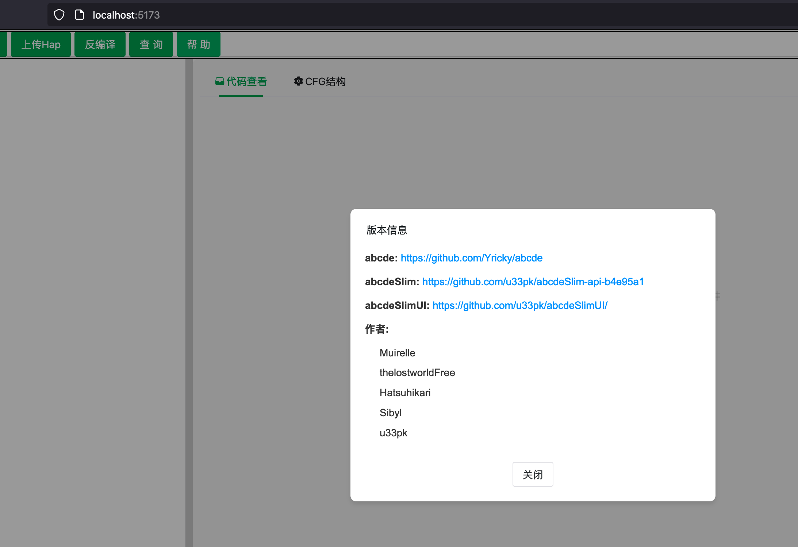

## 技术栈

1. Core: Vue3 + Vue-Router + Pinia
2. UI: [NaiveUI](https://www.naiveui.com/) + [XIcons/ionicons5](https://xicons.org/#/) + [UnoCSS](https://unocss.dev/)
3. Code Editor Core: [CodeMirror](https://codemirror.net/)


## IDE配置

[VSCode](https://code.visualstudio.com/) + [Volar](https://marketplace.visualstudio.com/items?itemName=Vue.volar) (and disable Vetur).

## 初始化

```sh
pnpm install
```

### 开发预览

```sh
pnpm dev
```

### 正式打包

```sh
pnpm build
```

### json依赖 安装 axios

```sh
pnpm add axios
```

### cfg依赖 安装 d3

```sh
pnpm add d3
```


## 功能更新记录

### 1、创建项目-UI&接口完成


### 2、上传hap-UI&接口完成



### 3、反编译-UI&接口完成




### 4、加载已有项目-UI&接口完成



成果反编译方法



### 5、CFG相关调用链-UI&接口测试通过



动态数据接口对接完成



支持缩放功能



### 6、ASM接口-UI&接口测试通过



### 7、帮助Version-UI&接口测试通过



### 
