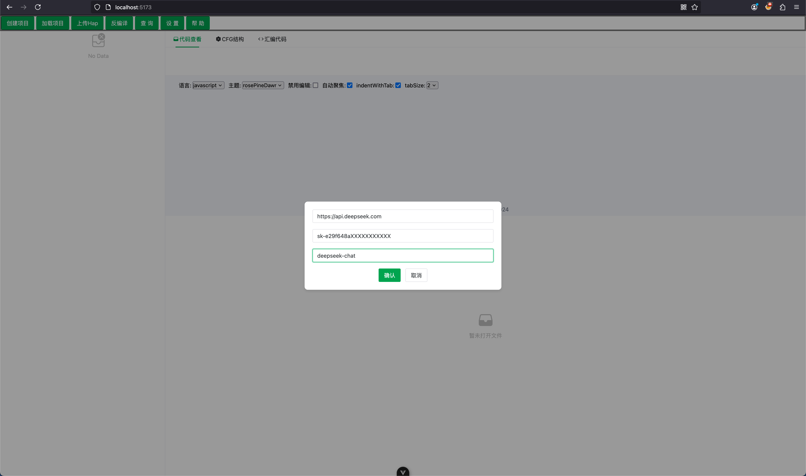
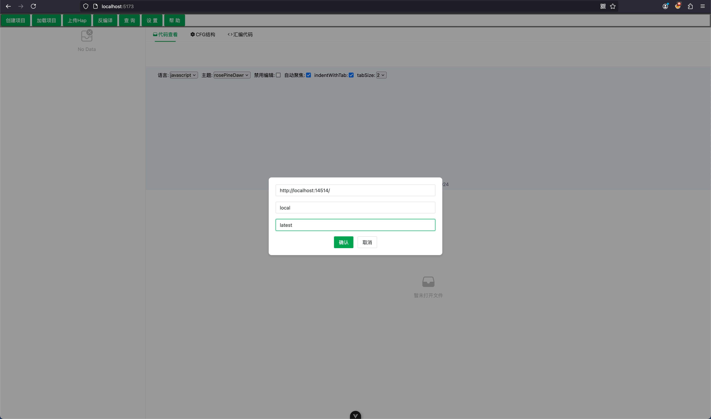
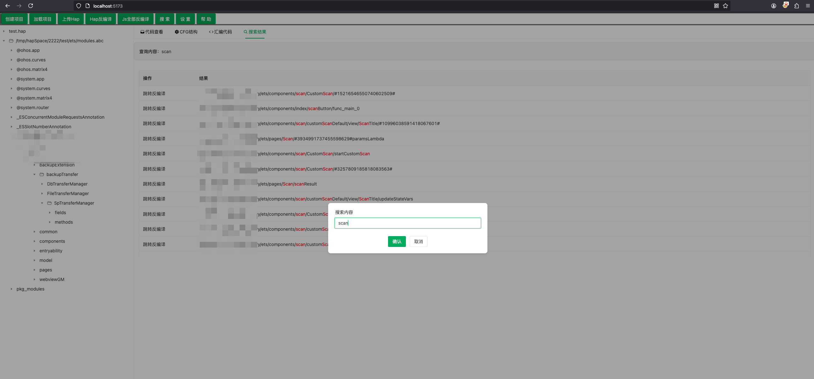
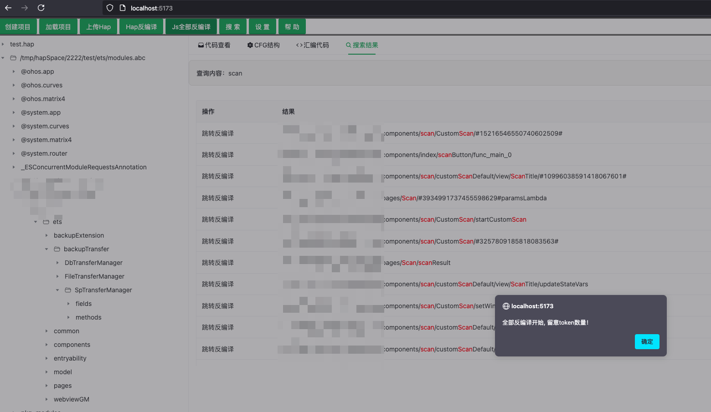

## 技术栈

1. Core: Vue3 + Vue-Router + Pinia
2. UI: [NaiveUI](https://www.naiveui.com/) + [XIcons/ionicons5](https://xicons.org/#/) + [UnoCSS](https://unocss.dev/)
3. Code Editor Core: [CodeMirror](https://codemirror.net/)


## IDE配置

[VSCode](https://code.visualstudio.com/) + [Volar](https://marketplace.visualstudio.com/items?itemName=Vue.volar) (and disable Vetur).

## 初始化

```sh
pnpm install
```

### 开发预览

```sh
pnpm dev
```

### 正式打包

```sh
pnpm build
```

### json依赖 安装 axios

```sh
pnpm add axios
```

### cfg依赖 安装 d3

```sh
pnpm add d3
```


## 功能更新记录

### 1、创建项目-UI&接口完成


### 2、上传hap-UI&接口完成


### 3、反编译-UI&接口完成


### 4、加载已有项目-UI&接口完成

逻辑更新，加载项目根据redis本地缓存读取，加载全部已经反编译内容


成果反编译方法


### 5、CFG相关调用链-UI&接口测试通过


动态数据接口对接完成


支持缩放功能


### 6、ASM接口-UI&接口测试通过


### 7、更新大模型API Config(可本地可远程)-UI&接口测试通过



本地配置



### 8、帮助Version-UI&接口测试通过


### 9、搜索功能-UI&接口测试通过

查询颜色高亮、点击关联跳转（代码编译、CFG解析、ASM解析）



todo：左边tree展示根据选择函数进行，跳转展示

### 11、JS全部反编译功能-UI&接口测试通过

这个执行完成，调用大模型API反编译，全部反编译开始, 留意token数量！


